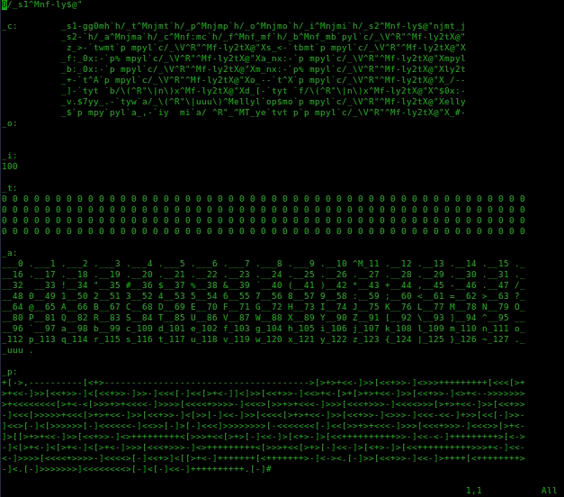

# _vimmmex_ : a vim execution engine

### Overview

_vimmmex_ is an illustration that a turing machine can be built from 
copy/paste/search/replace style operations, informally showing the
turing-completeness of regular vim commands.  we limit ourselves to only the
"normal" vim commands - that is, vim "ex" commands (those commands that begin
with a colon) and vimscript are avoided, as these are already powerful, and
showing their turing completeness is trivial.  specifically, vimmmex implements
a brainf@!# interperter with vanilla vi commands.

### Usage

to use the interpreter, open the file [vimmmex](vimmmex) in vanilla vim.  if
possible, reduce the font size so that the entire file fits on the screen - this
will make observing execution easier.  press gg2yy@" to launch the interpreter.
the default BF program calculates prime numbers, up to 100.  the numbers will
appear on the output line (below "_o:") as they are calculated.  calculations
are performed by copying and pasting characters while moving about the file
through searches and cursor movement keys.

### Demonstration

| Calculating prime numbers               |
|:---------------------------------------:|
|         |

| ... while tracking the cursor movement  |
|:---------------------------------------:|
|  |

### Versions

the [vimmmex_raw](vimmmex_raw) file contains (non-ascii) vim special characters,
such as ^M and ^R.  [vimmmex](vimmmex) provides a pure-ascii version of the
interpreter, in which special characters are inserted by the execution process
itself, but uses an (ideally forbidden) vim "ex" command (the first line) to
perform the substitution.  this may be more conducive for copying and pasting
the contents of the file.

### Limitations

the only non-vi compatible requirement is that "whichwrap" is set to at least
"b,s" - this is the default for vim, and is automatically configured when
"nocompatible" is set.  this requirement is only in place for aesthetics, as it
allows breaking one long line into several smaller lines.

### Author

_vimmmex_ is a proof-of-concept from Christopher Domas
([@xoreaxeaxeax](https://twitter.com/xoreaxeaxeax)).
